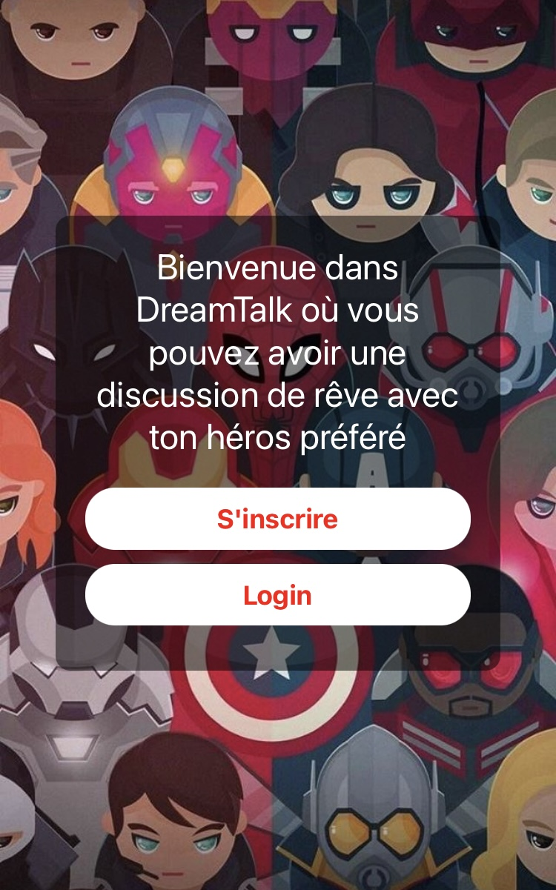
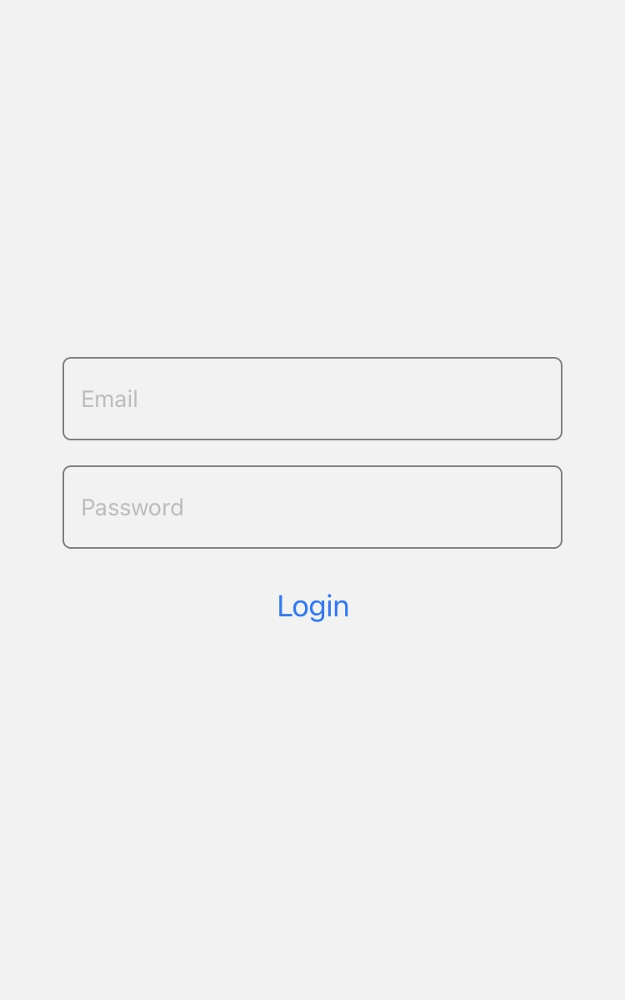

# Dream Talk • Application Expo App (React Native)

Le projet Dream Talk est une application mobile de messagerie développée
en React Native. Elle permet à des utilisateurs de s'inscrire, 
de se connecter, de créer une discussion avec leur personnage fictif préféré.

Il s'agit d'une application qui utilisera l'API d'Open AI pour générer des réponses
à partir de l'entrée de l'utilisateur et du personnage fictif choisi.

Les données des utilisateurs seront stockées dans une base de données FireBase.

## Démarrer l'appli 
```bash
sudo npm install
```
```bash
sudo npx expo install --fix
```
```bash
npx expo start
```

## Étape du projet 

- Compréhension de la syntaxe React Native 💭
- Création des premiers composants ✅
- Création du premier écran ✅
- Création du premier formulaire ✅
- Authentification ✅
- Conception de la base de données ✅
- Page de profil : ajouts et modifications, infos persos ✅
- Implémentation de l'API Open AI ✅
- Page de choix d'un héro 🔜
- Discussions, gestion des données 🔜
- Création de la page de création de discussion 🔜
- 


## Screens du 15 décembre 2023

### aperçu de l'app (3 écrans)



## Prompt pour la création d'un nouvel Agent

```bash
Tu dois seulement répondre par oui ou par non :

Si tu étais configuré pour etre un chatbot conversationnel et que tu devais incarner une célébrité, un personnage réel ou fictif connu. Si je te disais d'incarner "La Tour Eiffel", considererai tu cela comme un bon personnage à configurer ?
```